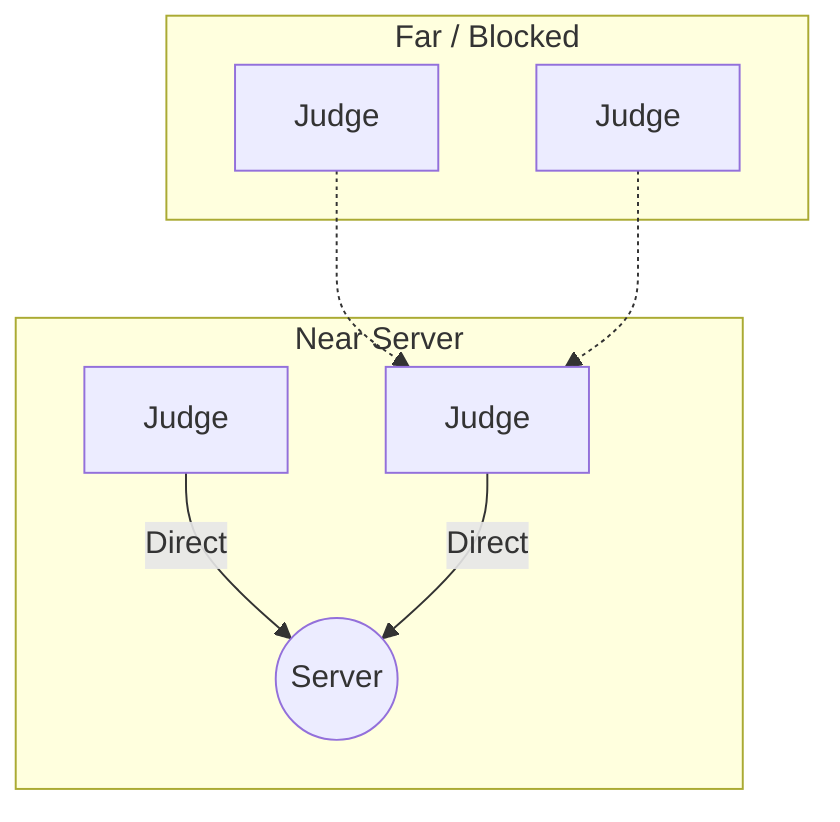

# 01. Architecture & Vision

> **Status:** Draft / Active
> **Version:** 1.1 (Firefly Update)
> **Target Framework:** .NET 10 MAUI

## 1. Executive Summary

**Nodus** is a decentralized, offline-first evaluation system designed for high-density environments.

Unlike traditional apps that fail when Wi-Fi gets congested, Nodus uses a **"Firefly" Swarm Protocol**. It turns the audience into a living, breathing network where devices dynamically wake up to bridge gaps in coverage and then sleep to save battery.

## 2. Core Constraints (The "Physics of the Room")

1.  **RF Saturation:** 500 active Bluetooth radios create a "DDoS" effect.
2.  **Battery Anxiety:** We cannot ask a user to burn 50% battery to help others.
3.  **OS Guardrails:** iOS and Android kill background processes aggressively.

## 3. The Solution: "Dynamic Swarm"

We do not have permanent "Repeaters". We have roles that rotate.

- **Protocol:** Nodes use a **probabilistic** algorithm ("Trickle") to decide if they should relay data.
- **Result:** A self-healing mesh that adapts to people moving around the room.

## 4. System Roles

### A. The Admin Node (The "Queen") — `Nodus.Admin`

- **Device:** Windows Laptop / Tablet. (**Windows only. This is not a mobile app.**)
- **Role:** The target destination and event controller. The only node that _never_ sleeps.
- **Serves:** The local HTTP endpoint that students use to register projects.

### B. The Judge Node (The "Firefly") — `Nodus.Judge`

- **Device:** Android/iOS Phone.
- **Role:**
  - **Observer:** Most of the time, just voting and listening.
  - **Relay:** If well-positioned, it briefly turns into a relay node to help neighbors upload their votes via the dynamic Firefly Swarm protocol.

### C. The Student (The Talent) — `Nodus.Web`

- **Device:** Any smartphone or computer with a browser.
- **Transport:** **Wi-Fi only** (HTTP). No BLE involvement.
- **Role:**
  - **Registration:** Opens the Event Registration URL on their phone's browser. Fills the form.
  - **Display:** Browser screen shows the Project QR that Judges scan to vote.

## 5. Deployment Topological View (Logical)

_J2 sees the server clearly. It becomes a **LINK** node. J3 and J4 see J2, so they hand off their packets to J2. After 60 seconds, J2 enters **COOLDOWN**, and J1 takes over._

---

## 6. Application Ecosystem

The system is composed of **3 end-user applications** and **1 shared API layer**:

| App | Platform | Users | Transport |
|:----|:---------|:------|:----------|
| **Nodus.Admin** | Windows Desktop (WinUI 3 / MAUI) | Event Organizer | BLE (GATT Server) + Local HTTP |
| **Nodus.Judge** | Android / iOS (MAUI) | Judges | BLE (Swarm Client/Relay) |
| **Nodus.Web** | Any Browser (Blazor WASM) | Students | HTTP/Wi-Fi only |
| **Nodus.API** | .NET 10 Web API | All apps (online sync) | HTTPS → MongoDB |

> **Architecture decision:** There is no `Nodus.Shared` library. Each app owns its own models and services. Common types are duplicated deliberately to keep apps fully independent and deployable without cross-project dependencies.
