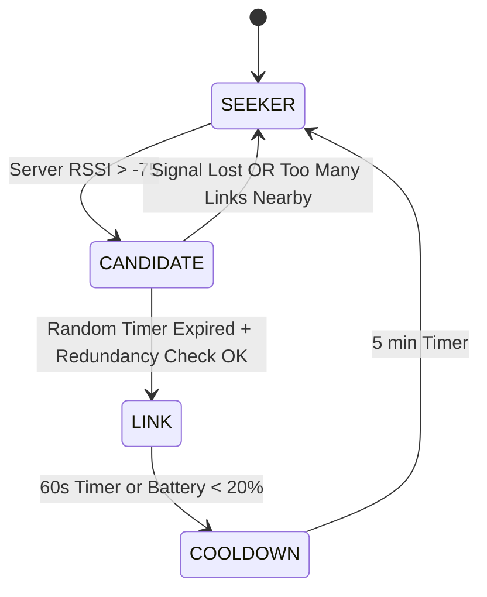

# 02. Network: The Nodus Swarm Protocol

> **Status:** Active (Firefly / Dynamic Swarm)
> **Protocol Version:** 3.0 "Firefly"
> **Core Algorithm:** Randomized Logic + Trickle-based Flooding

## 1. Topologies: The "Breathing Mesh"

Nodus uses a **Dynamic Opportunistic Swarm** (aka "Firefly Protocol"). There are no fixed "Bridge" nodes.
Every node is a potential relay, but only for short bursts and only if it helps the swarm.

### Why "Firefly"?

Like fireflies synchronized in a forest, nodes "light up" (Advertise) briefly to carry data, then "go dark" (Scan) to save energy and reduce noise.

---

## 2. The "Firefly" State Machine (FSM)

Every Nodus Client runs this loop every 1-5 seconds.

### A. The States

1.  **SEEKER (Default):**
    - **Behavior:** Scanning only. Silent.
    - **Goal:** Find the Server or a Link.
2.  **CANDIDATE:**
    - **Trigger:** Sees Server with strong signal (RSSI > -75dBm).
    - **Behavior:** Waits a random `t` interval (Trickle Logic).
    - **Goal:** Check if becoming a Link is necessary.
3.  **LINK:**
    - **Trigger:** Timer expired & still good signal & Traffic is low.
    - **Behavior:** ADVERTISING as a Server Proxy. Relays packets.
    - **Duration:** Max 60 seconds (Time-to-Live for the role).
4.  **COOLDOWN:**
    - **Trigger:** Link usage finished.
    - **Behavior:** Banned from being a Link for 5 minutes.
    - **Goal:** Force rotation to other devices (Load Balancing).



---

## 3. Optimization: The "Trickle" Algorithm

To prevent "Broadcast Storms" (50 nodes turning on at once), we use a simplified Trickle Algorithm.

### Rules of Engagement

1.  **Redundancy Constant (`k`):**
    - A Candidate listens. If it hears `>= 2` other LINK nodes advertising nearby (`RSSI > -80`), it **cancels** its own promotion.
    - _Why?_ Two bridges are enough. Three is a crowd.

2.  **Random Wait (`t`):**
    - Upon becoming a Candidate, pick `t` between `low_interval` (**3s**) and `high_interval` (**15s**).
    - This desynchronizes devices so they don't all collide.

### iOS Constraint (The "Foreground" Rule)

- **iOS Devices:** Can only be in **LINK** state if the App is **OPEN and FOREGROUND**.
- **Android Devices:** Can be **LINK** in background (with Sticky Notification).

---

## 4. Packet Structure & Routing

### JSON Envelope

```json
{
  "packet_id": "GUID-V4",
  "hops": ["JudgeA", "LinkB"],
  "payload": "ENCRYPTED_BLOB",
  "ttl": 2 // Max RELAY hops. Origin (Judge) and destination (Server) are NOT counted.
           // ttl=2 means: Judge → Relay1 → Relay2 → Server (2 intermediate relays max).
}
```

### The "Loop" Defense

1.  **Max TTL:** A packet allows up to **2 relay hops** before dying. Full path: `Judge → Relay1 → Relay2 → Server`. If `hops.length >= ttl`, the relay drops the packet silently.
2.  **Bloom Filter:** Nodes remember `packet_id` for 10 mins. Duplicates are dropped silently.

> **Canonical FSM Reference:** This document (Doc 02) is the **single source of truth** for the Firefly State Machine. Any other document that defines FSM states or parameters is superseded by this one.

### Packet Types & Byte Prefixes

A 1-byte prefix identifies the payload type in every BLE write:

| Prefix | Type | Direction | Description |
|:-------|:-----|:----------|:------------|
| `0x01` | Vote / JSON data | Judge → Admin | Encrypted vote payload (append-only) |
| `0x02` | Media data | Judge → Admin | Photo/audio chunk (Mule Mode only, Decision #23) |
| `0x03` | Bootstrap data | Admin → Judge | `event_bootstrap`: full project list + rubric (Decision #27) |
| `0x04` | Project sync | Admin → Judge | `project_sync`: delta of new projects since last pull (Decision #29, #42) |
| `0x05` | Blocklist sync | Admin → LINK nodes | `blocklist_sync`: updated blocked-key list broadcast via `NODUS_ACK_NOTIFY` (Decision #41) |
| `0x06` | Sync request | Judge → Admin | `sync_request`: Judge sends `since_seq` cursor before reading `NODUS_BOOTSTRAP_READ` (Decision #56) |
| `0xA1` | ACK | Admin → Judge | Acknowledgement notification via `NODUS_ACK_NOTIFY` |

### `event_bootstrap` Packet (Prefix `0x03`)

Delivered by Admin via `NODUS_BOOTSTRAP_READ` immediately after a Judge sends `judge_register`. Contains the full project list and the evaluation rubric at the moment of onboarding (Decision #18, #27, #40).

```json
{
  "type": "event_bootstrap",
  "event_id": "EVT-XYZ",
  "rubric_version": 3,
  "rubric": {
    "criteria": [
      { "id": "c1", "label": "Originality", "min": 1, "max": 10, "weight": 1.0, "step": 1 },
      { "id": "c2", "label": "Execution",   "min": 0, "max": 5,  "weight": 2.0, "step": 0.5 }
    ]
  },
  "projects": [
    {
      "id": "PROJ-A3X",
      "event_id": "EVT-XYZ",
      "sequence_number": 1,
      "name": "Team Alpha",
      "category": "Software",
      "stand_number": "A-12"
    }
  ]
}
```

- **`rubric_version`:** Judge stores this. If a future `project_sync` carries a higher `rubric_version`, the Judge fetches a fresh bootstrap to update the rubric (Decision #40).
- **`projects`:** Full list up to onboarding moment. Equivalent to `project_sync` with `since_seq = 0` but also carries the rubric.
- **`sequence_number`:** Must be stored per-project. The Judge uses the highest value as `since_seq` in all future `project_sync` polls (Decision #39).
- **Chunking:** Payload is split into 180-byte chunks via the same `ATT_READ_BLOB_REQ` paging used for all `NODUS_BOOTSTRAP_READ` reads (Decision #36).

---

### `project_sync` Packet (Prefix `0x04`)

Emitted by Admin via `NODUS_BOOTSTRAP_READ` in response to the Judge's periodic poll (every `Random(50s, 70s)`, Decision #29, #43). When the event is closed, Admin appends `"event_status": "closed"` to this response (Decision #45).

> ⚠️ **Pre-requisito de protocolo (Decisión #56):** Antes de leer `NODUS_BOOTSTRAP_READ` para obtener `project_sync`, el Judge **debe** primero escribir un paquete `sync_request` (prefijo `0x06`) en `NODUS_DATA_WRITE` con su `since_seq` actual. El Admin prepara el delta en memoria antes de que el Judge ejecute el `ATT_READ_BLOB_REQ`. Ver sección `sync_request` más abajo.

```json
{
  "type": "project_sync",
  "rubric_version": 3,
  "since_seq": 42,
  "event_status": "active",
  "projects": [
    {
      "id": "PROJ-A3X",
      "event_id": "EVT-XYZ",
      "sequence_number": 43,
      "name": "Team Alpha",
      "category": "Software",
      "stand_number": "A-12"
    }
  ]
}
```

- **`event_status`:** `"active"` (normal) or `"closed"` (event ended — Decision #45). When `"closed"`, the Judge stops polling and displays the event-closed banner.

- **`since_seq`:** The Judge sends the highest `SequenceNumber` it has locally. Admin returns only projects with `SequenceNumber > since_seq`. If the Judge has no projects yet, it sends `since_seq = 0` (Decision #39).
- **`rubric_version`:** Judge compares this value to its locally stored `rubric_version`. If higher, the Judge requests a full `event_bootstrap` on the next poll cycle to update the rubric (Decision #40).
- **`sequence_number` (per project):** Enables the Judge to advance its local cursor. After merging, the Judge stores the highest `sequence_number` received as the new `since_seq` for future polls (Decision #39).
- **Merge rule:** Judge inserts new rows into local SQLite. Existing records are not overwritten.
- **Poll interval:** `Random(50s, 70s)` — jittered to prevent 50 judges simultaneously connecting to the Admin GATT server (Decision #43).
- **Chunking:** If the delta exceeds 180-byte MTU, same chunking protocol as `event_bootstrap` applies (Decision #36).

---

### `blocklist_sync` Packet (Prefix `0x05`)

Emitted by Admin as a Notify on `NODUS_ACK_NOTIFY` whenever a judge is blocked (best-effort broadcast to active LINK nodes only — Decision #41).

```json
{
  "type": "blocklist_sync",
  "blocked_keys": [
    "BASE64_ED25519_PUBLIC_KEY_1",
    "BASE64_ED25519_PUBLIC_KEY_2"
  ]
}
```

- **Scope:** Only nodes currently in **LINK** state receive this notification (they are connected to Admin via GATT at that moment).
- **Enforcement:** The Server is the **authoritative** enforcement point. A packet signed by a blocked key that slips past a relay is still rejected at the Admin.
- **LINK node behaviour:** Upon receiving `blocklist_sync`, the relay drops any subsequent packets whose signature matches a blocked key during its remaining LINK window.
- **Delivery:** Carried as a GATT Notification on `NODUS_ACK_NOTIFY` (prefix `0x05`).

---

### `sync_request` Packet (Prefix `0x06`)

Written by Judge to `NODUS_DATA_WRITE` **immediately before** polling `NODUS_BOOTSTRAP_READ` for a `project_sync` delta. This is how the Judge passes its `since_seq` cursor to the Admin (GATT Read operations do not carry a request body).

```json
{
  "type": "sync_request",
  "judge_id": "UUID-V4-OF-JUDGE",
  "since_seq": 42
}
```

**Admin behaviour upon receiving `sync_request`:**
1. Queries SQLite: `SELECT * FROM Projects WHERE EventId = ? AND SequenceNumber > 42`.
2. Serializes the result as a `project_sync` payload (prefix `0x04`, Decision #42).
3. Stores the result in an in-memory buffer keyed by `judge_id`, with a **30-second TTL**.
4. The Judge immediately reads `NODUS_BOOTSTRAP_READ` (paged `ATT_READ_BLOB_REQ`) to retrieve the pre-computed delta.
5. Buffer is discarded after successful read or TTL expiry.

**Fallback:** If the Admin receives a `BOOTSTRAP_READ` without a preceding `sync_request` from that `judge_id` (e.g., stale connection, legacy client, or buffer expired), Admin responds with the full `event_bootstrap` payload (`since_seq = 0`). This prevents silent failure.

**Note:** The `judge_register` flow (Decision #17, #35) does **not** require a `sync_request` — the bootstrap response is automatically the full `event_bootstrap` (prefix `0x03`). `sync_request` is only for subsequent delta polls.

---

## 5. Advertising Data (The "Pheromone")

Nodes in **LINK** mode modify their Advertisement Data to signal their utility.

- **Service UUID:** `NODUS_MAIN_SERVICE` = `6E6F6400-0000-0000-0000-000000000001` (Decision #25)
- **Manufacturer Data (Byte 0):** `0x02` (I am a Relay).
- **Manufacturer Data (Byte 1):** `0x50` (Battery Level 80%).

_Seekers prefer Links with higher Battery levels._

---

## 6. GATT Service & Characteristics (Canonical UUIDs)

> **Single source of truth:** Decision #25 & #50 (Doc 00).

All Nodus nodes advertise **`NODUS_MAIN_SERVICE`** — this is how a SEEKER identifies both the Admin and any active LINK relay. However, **Admin and LINK nodes expose different subsets of characteristics**:

| Constante              | UUID                                   | Tipo GATT            | Admin | LINK relay | Propósito |
|:-----------------------|:---------------------------------------|:---------------------|:-----:|:----------:|:----------|
| `NODUS_MAIN_SERVICE`   | `6E6F6400-0000-0000-0000-000000000001` | Primary Service      | ✅ | ✅ | Identifica cualquier nodo Nodus |
| `NODUS_DATA_WRITE`     | `6E6F6400-0000-0000-0000-000000000002` | WriteWithoutResponse | ✅ | ✅ | Cliente escribe paquetes de voto y chunks → relay los reenvía al Admin |
| `NODUS_ACK_NOTIFY`     | `6E6F6400-0000-0000-0000-000000000003` | Notify               | ✅ | ✅ | Servidor (Admin) envía ACKs y `blocklist_sync`; relay reenvía ACKs del Admin |
| `NODUS_BOOTSTRAP_READ` | `6E6F6400-0000-0000-0000-000000000004` | Read                 | ✅ | ❌ | **Admin-only.** Juez lee `event_bootstrap` (Decision #27) y `project_sync` delta (Decision #29, #43). Un nodo LINK NO expone esta característica — no posee el catálogo de proyectos ni la rúbrica. |

> **Implicación operacional:** Un Judge que necesite `project_sync` y solo tenga visibilidad de nodos LINK (sin ver el Admin directamente) debe esperar a estar en rango del Admin para hacer el poll de delta. Los polls de `project_sync` son **siempre directos al Admin**. Los votos (`NODUS_DATA_WRITE`) sí pueden viajar a través de LINK relays.

> Nota: `6E6F64` es ASCII hex de `"nod"` (de Nodus). (Decision #50)
